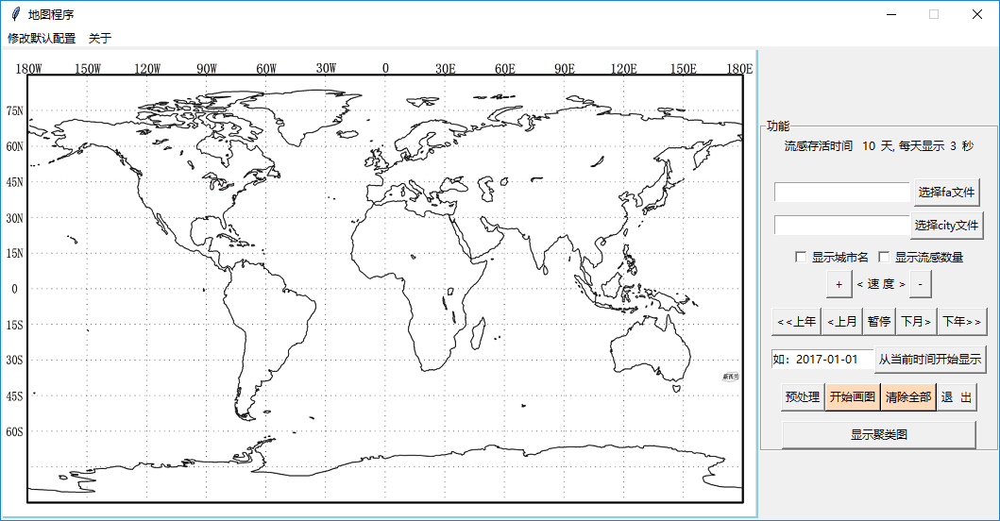
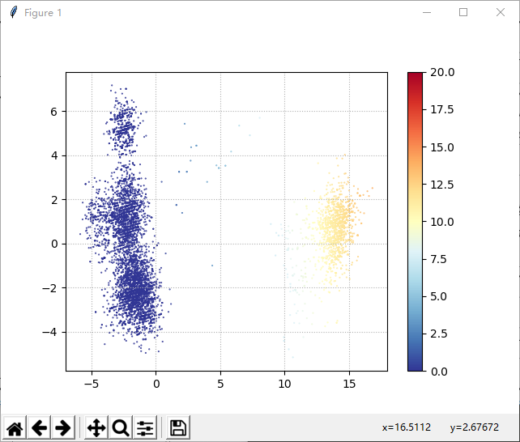

# 全球性 流感 传播过程 重构 平台

Reconfigurable Platform of Spreading Process of Global Influenza.

## screenshot

初始页面：

重构演示：

降维结果展示：

## User Guide

[Guide.md](./docs/Guide.md)

## Functions

该平台基于Python3.6语言开发, 主要实现了以下两方面功能：

- 以人工导入的方式实现NCBI数据库 (https://www.ncbi.nlm.nih.gov/genomes/FLU/Database/nph-select.cgi?go=database) 中流感疫情监控数据的导入，包括流感基因氨基酸序列和全球流感发生地城市的经纬度信息，并自动提取每一流感样本的爆发时间、地点等信息，再按照时间顺序将所有病毒样本及其对应的爆发时间、地点等信息在世界地图中重现，用以重构病毒的全球性传播过程。

- 该平台还可以自动提取出氨基酸序列中不同流感对应的氨基酸序列信息，在PCA降维处理之后，进一步进行可视化表示，以一种更为直观的方式来发现流感病毒的进化趋势。

This platform is designed on the base of python3.6 language. Its operating process can be divided into following steps: 

- For the first step, manually inputting monitoring data of influenza from NCBI(National Center for Biotechnology Information), including amino acid sequence file and the global urban latitude and longitude information file. For the second step, the program automatically extracts information about the time and place of the influenza outbreak in the file. For the last step, the program reconstructs all the flu information and its corresponding outbreak time and location in the world map in chronological order. 

- This program can automatically extract the amino acid sequence of different influenza and corresponding sequence information, and then the amino acid sequence will be processed on PCA data dimension reduction, and finally the processing results are clearly displayed on the reconfigurable platform. In this way, the evolving trend of influenza virus can be obtained directly. 

## Any advice or sugggestions

Any advice or sugggestions, please mail to b4zinga@outlook.com