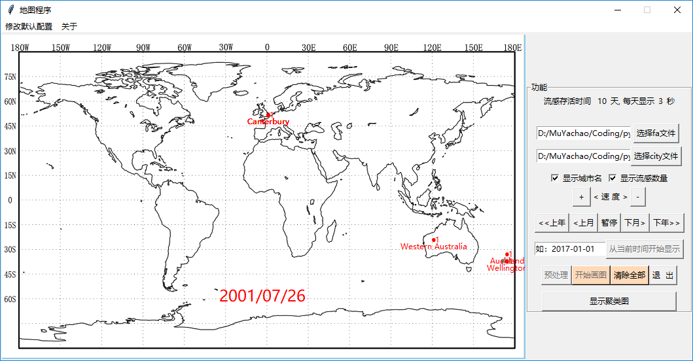

# Guide

1. 点击 "选择fa文件" , 选择data目录下的fa文件

2. 点击 "选择city文件" , 选择data下对应的txt文件(里面存储的城市经纬度信息)

3. 点击 "开始画图" , 程序会自动匹配2个文件中的关键信息，然后开始在世界地图上重构演示

4. 点击 "上年"、 "上月"、 "下月"、 "下年" 进行时间跳转

5. 点击 "+" 或 "-" 进行速度调节

6. 点击 "显示聚类图" , 程序会提取fa文件中的关键信息, 然后降维至2维并显示

7. 点击 "从当前时间开始显示" , 程序会读取前面输入框内时间，然后从这个时间开始演示

8. 点击 "修改默认配置" , 程序会弹出窗口，允许用户修改流感存活时间 和 演示过程中每天显示的时间

---

1. Click "选择fa文件" to select the fa file in the data directory

2. Click "选择city文件" and select the corresponding TXT file under data (the city longitude and latitude information stored in it)

3. Click "开始画图", the program will automatically match the key information in the two files, and then start the reconstruction demonstration on the world map

4. Click "上年"、 "上月"、 "下月"、 "下年" for a time jump

5. Click "+" or "-" to adjust the speed

6. Click "显示聚类图", the program will extract the key information in the fa file, and then reduce the dimension to 2 dimensions and display

7. Click "从当前时间开始显示", the program will read the time in the previous input box, and then start the demonstration from this time

8. Click "修改默认配置", and the program will pop up a window, allowing the user to modify the duration of the flu and the time of day displayed during the demonstration

